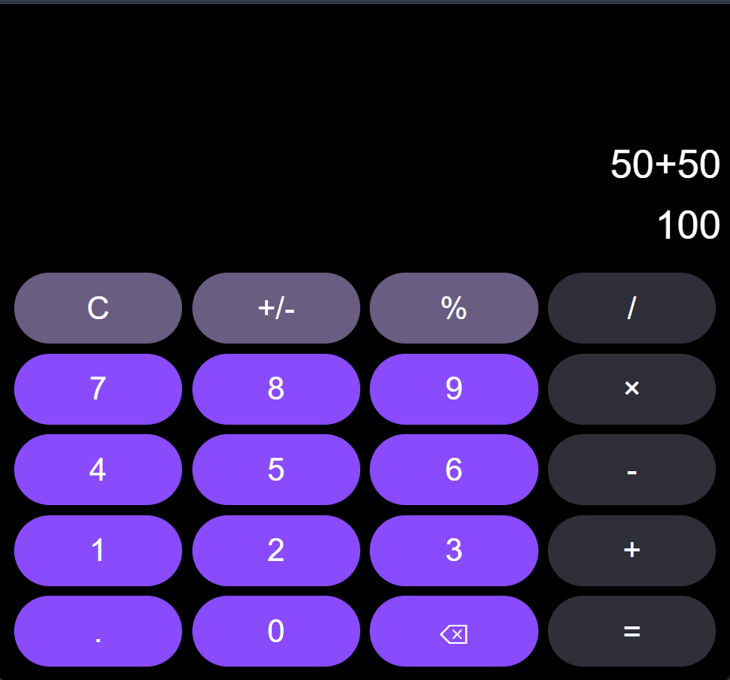

# 🧮 Calculator Application

A modern, interactive calculator built with vanilla HTML, CSS, and JavaScript. This project demonstrates fundamental web development concepts and JavaScript logic for beginners.

## 📋 Table of Contents

- [Features](#features)
- [Technologies Used](#technologies-used)
- [Project Structure](#project-structure)
- [How to Use](#how-to-use)
- [Installation](#installation)
- [Screenshots](#screenshots)
- [Learning Concepts](#learning-concepts)
- [How It Works](#how-it-works)
- [Future Improvements](#future-improvements)
- [Author](#author)
- [License](#license)

## ✨ Features

- ✅ **Basic Arithmetic Operations** - Addition, subtraction, multiplication, and division
- ✅ **Decimal Support** - Perform calculations with decimal numbers
- ✅ **Percentage Calculations** - Convert numbers to percentages
- ✅ **Negate Function** - Toggle between positive and negative numbers
- ✅ **Clear & Backspace** - Reset calculations or remove last digit
- ✅ **Real-time Display** - Shows both expression and result
- ✅ **Responsive Design** - Works on different screen sizes
- ✅ **Clean UI** - Modern dark theme with intuitive button layout

## 🛠 Technologies Used

| Technology | Purpose |
|-----------|---------|
| **HTML5** | Structure and layout of the calculator |
| **CSS3** | Styling, colors, and responsive design |
| **JavaScript (Vanilla)** | Logic, event handling, and calculations |

## 📁 Project Structure

```
calculator/
├── index.htm       # Main HTML file with calculator structure
├── calculator.js   # JavaScript logic and functionality
├── style.css       # Styling and layout
└── README.md       # This file
```

### File Descriptions

**index.htm**
- Contains the HTML structure of the calculator
- Defines button layout with data attributes for actions
- Links CSS and JavaScript files
- Output section for displaying expression and result

**calculator.js**
- Core JavaScript logic for calculator operations
- Event listeners for button clicks
- Functions for arithmetic operations and display updates
- Data validation and error handling

**style.css**
- Dark theme styling with CSS variables
- Button styling with hover effects
- Flexbox layout for responsive design
- Color scheme with purple accents

## 🚀 How to Use

1. **Open the Calculator**
   - Double-click `index.htm` or open it in your browser

2. **Enter Numbers**
   - Click number buttons (0-9) to build your number

3. **Perform Operations**
   - Click an operation button (+, -, ×, ÷)
   - Enter the second number
   - Click `=` to get the result

4. **Additional Functions**
   - **C** - Clear all and start over
   - **+/-** - Toggle between positive and negative
   - **%** - Convert to percentage
   - **←** - Delete the last digit (backspace)
   - **.** - Add decimal point

### Example Calculation
```
50 + 50 = 100
12.5 × 8 = 100
100 ÷ 4 = 25
```

## 💻 Installation

### Quick Start (No Installation Needed)
1. Download or clone this repository
   ```bash
   git clone https://github.com/yourusername/calculator.git
   ```

2. Navigate to the project folder
   ```bash
   cd calculator
   ```

3. Open `index.htm` in your web browser
   - Windows: Double-click the file
   - Mac: Right-click → Open With → Your Browser
   - Linux: Right-click → Open With → Your Browser

### Alternative: Using a Local Server
For better performance, use a local server:

**Using Python:**
```bash
# Python 3
python -m http.server 8000

# Python 2
python -m SimpleHTTPServer 8000
```

**Using Node.js (with http-server):**
```bash
npx http-server
```

Then open `http://localhost:8000` in your browser.

## 📸 Screenshots

### Calculator Interface


*A modern calculator with dark theme, purple accent buttons, and easy-to-read display.*

### To Take Your Own Screenshot:
1. Open the calculator in your browser
2. **Windows:** Press `Print Screen` or `Shift + Windows + S`
3. **Mac:** Press `Cmd + Shift + 4`
4. **Linux:** Use `Print Screen` or use a screenshot tool like `gnome-screenshot`
5. Save the image as `screenshot.png` in the project folder
6. (Optional) Use an online tool like [TinyPNG](https://tinypng.com/) to compress the image

## 🧠 Learning Concepts

### JavaScript Concepts Demonstrated

1. **DOM Manipulation**
   ```javascript
   document.getElementById('input')
   element.textContent
   ```

2. **Event Listeners**
   ```javascript
   inputBox.addEventListener('click', btnClick)
   event.target (Event delegation)
   ```

3. **Data Attributes**
   ```javascript
   target.dataset.action
   target.dataset.value
   ```

4. **Conditional Logic**
   ```javascript
   switch case statements
   if/else conditions
   ternary operators
   ```

5. **String Manipulation**
   ```javascript
   expression.lastIndexOf()
   expression.slice()
   expression.search()
   ```

6. **Regular Expressions (Regex)**
   ```javascript
   /[+\-*/]/ (Pattern matching for operators)
   ```

7. **Array Methods**
   ```javascript
   Math.max()
   ```

### CSS Concepts Demonstrated

1. **CSS Variables** - `:root` and `--variable-name`
2. **Flexbox Layout** - Creating responsive grid layouts
3. **Pseudo-classes** - `:hover`, `:focus`
4. **Responsive Design** - Flexible button sizing with `flex-basis`

## 🔧 How It Works

### Calculator Logic Flow

1. **User clicks a button** → Event listener triggers
2. **Get button's action and value** → From data attributes
3. **Process the action** → Switch case handles different button types
4. **Update the display** → Show expression and result in real-time
5. **Handle edge cases** → Prevent invalid operations (multiple decimals, operators in sequence)

### Key Functions

| Function | Purpose |
|----------|---------|
| `btnClick()` | Main event handler for button clicks |
| `addValue()` | Adds numbers and operators to expression |
| `decimal()` | Handles decimal point logic |
| `submit()` | Evaluates the expression and shows result |
| `clear()` | Resets calculator to initial state |
| `backspace()` | Removes last character |
| `negate()` | Toggles positive/negative sign |
| `percentage()` | Converts number to percentage |
| `updateDisplay()` | Updates the output display |

## 🎯 Future Improvements

- [ ] Add keyboard support (0-9, +, -, *, /, Enter, Backspace)
- [ ] Implement calculation history
- [ ] Add scientific functions (square root, power, etc.)
- [ ] Implement error handling for invalid operations
- [ ] Add unit tests with Jest or Vitest
- [ ] Create a dark/light theme toggle
- [ ] Add number formatting with commas (1,000.50)
- [ ] Implement memory functions (M+, M-, MR, MC)
- [ ] Add sound effects for button clicks
- [ ] Convert to a PWA (Progressive Web App)

## 👨‍💻 Author

**Okeyode Victor**

- GitHub: [Your GitHub Profile](https://github.com/yourusername)
- Email: your.email@example.com

## 📄 License

This project is licensed under the MIT License - see the LICENSE file for details.

### MIT License Summary
You are free to:
- ✅ Use this code personally or commercially
- ✅ Modify and distribute the code
- ✅ Use it in your own projects

Just include this license and credit the original author.

---

## 🤝 Contributing

Found a bug or want to suggest an improvement? Feel free to:
1. Fork the repository
2. Create a new branch (`git checkout -b feature/improvement`)
3. Make your changes
4. Commit your changes (`git commit -m 'Add improvement'`)
5. Push to the branch (`git push origin feature/improvement`)
6. Open a Pull Request

---

## 📚 Resources for Learning

### JavaScript Learning Resources
- [MDN Web Docs - JavaScript](https://developer.mozilla.org/en-US/docs/Web/JavaScript)
- [JavaScript.info](https://javascript.info/)
- [Eloquent JavaScript Book](https://eloquentjavascript.net/)

### Web Development Resources
- [CSS Tricks](https://css-tricks.com/)
- [W3Schools Web Development](https://www.w3schools.com/)
- [freeCodeCamp](https://www.freecodecamp.org/)

---

## 🎓 Tips for Beginners

1. **Understand the Code** - Read through `calculator.js` and try to understand each function
2. **Modify It** - Try changing colors in `style.css` to understand CSS
3. **Add Features** - Implement one of the "Future Improvements" to practice JavaScript
4. **Debug** - Use browser DevTools (F12) to debug and understand the flow
5. **Comment Your Code** - Add comments to explain what each part does

---

**Happy Learning! 🚀**

*Last Updated: May 2026*
